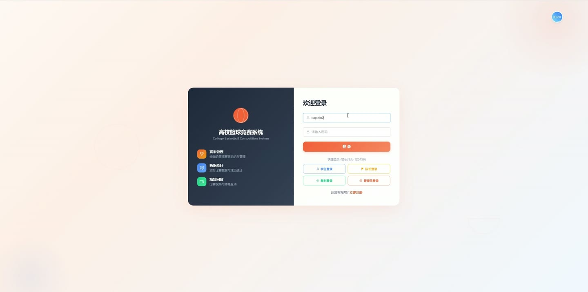
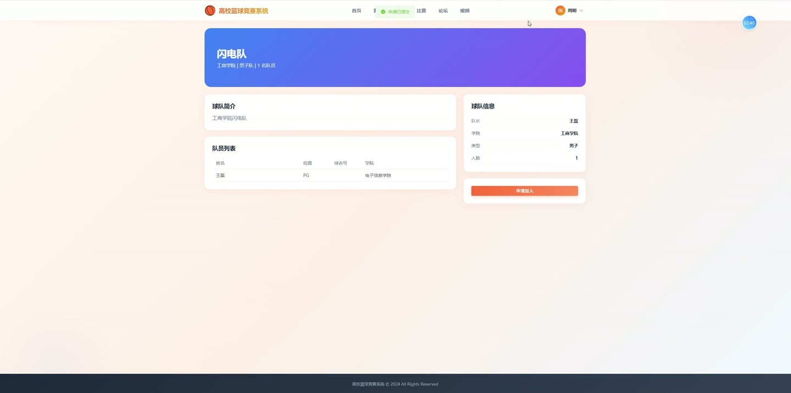
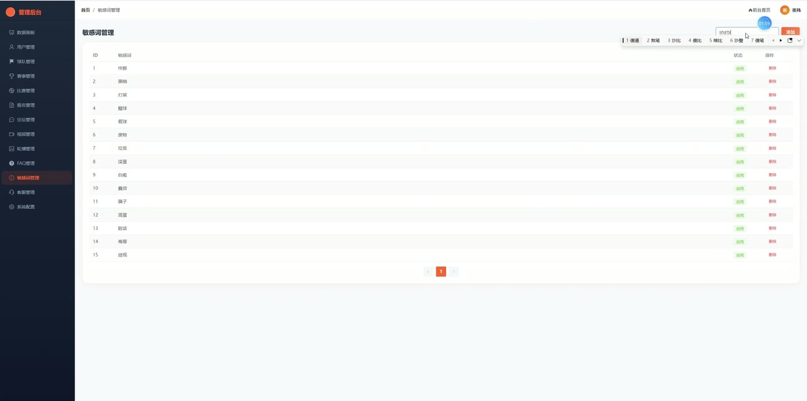
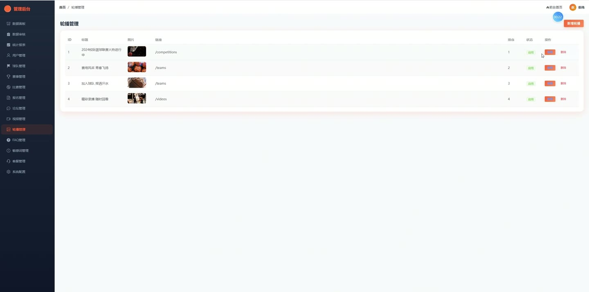
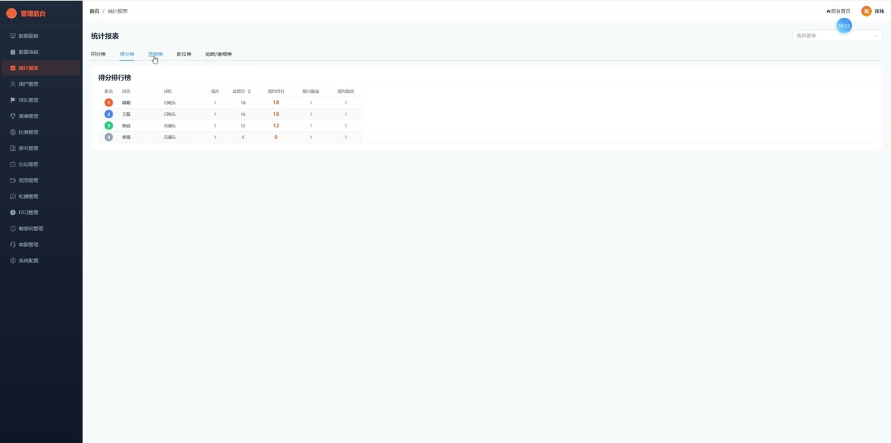

# (附文档)Springboot3+Vue3+MySQL 高校篮球竞赛系统

**技术栈**：Springboot3、Vue3、MySQL

### 系统简介

高校篮球竞赛系统是一套基于 SpringBoot3 + Vue3 前后端分离架构的全功能赛事管理平台，覆盖赛事创建、球队管理、比赛数据统计、论坛交流、智能客服、视频分享等核心业务场景。系统内置普通学生、队长、裁判、管理员四种角色，支持从报名参赛到技术统计、从社区互动到数据看板的完整闭环。
 
### 核心功能
 
### 普通用户端

 
- 注册/登录系统（支持学生、裁判角色注册，密码使用 BCrypt 加密存储） 
- 查看个人信息（真实姓名、学号、学院、手机、邮箱、头像）并编辑个人资料 
- 修改登录密码（需验证原密码正确性） 
- 浏览赛事列表（支持按赛事名称关键词搜索、按状态筛选，分页展示并显示已报名球队数） 
- 查看赛事详情（赛事名称、时间、地点、状态、已报名球队数量） 
- 浏览球队列表（支持按名称/学院关键词搜索、按球队类型筛选，仅显示已审核通过的球队） 
- 查看球队详情（球队名称、类型、学院、队长姓名、成员列表） 
- 申请加入球队（提交入队申请，队长审核通过后成为正式队员） 
- 查看已加入的球队列表（我的球队） 
- 浏览比赛列表（支持按赛事、状态、球队筛选，按比赛时间倒序排列） 
- 查看比赛详情（显示主客队名称、比分、比赛时间、裁判姓名、所属赛事） 
- 查看比赛球员统计数据（得分、篮板、助攻、抢断、盖帽，按球队分组展示） 
- 查看个人技术统计汇总（总场次、总分、总篮板、总助攻、场均得分/篮板/助攻等） 
- 浏览论坛帖子列表（支持按分类筛选、按标题/内容关键词搜索，置顶帖优先显示） 
- 查看帖子详情（显示标题、内容、作者、浏览量、点赞数、评论数） 
- 发布新帖子（标题和内容自动过滤敏感词，可设置投票选项） 
- 对帖子点赞/取消点赞（toggle 操作，同步更新帖子点赞数字段） 
- 查看帖子评论（按时间升序排列，支持嵌套回复，显示作者头像和回复对象） 
- 发表评论（自动过滤敏感词，支持回复指定楼层） 
- 参与帖子投票（每人每帖仅可投一次，查看各选项得票数和总投票数） 
- 浏览视频列表（筛选已发布的视频，按时间倒序） 
- 查看视频详情（播放视频、查看视频信息） 
- 使用智能客服聊天（发送文本消息，自动匹配 FAQ 关键词回复，支持转人工客服） 
- 查看聊天历史记录（按会话分组，显示每条消息的发送者、内容、时间） 
- 收藏/浏览球队（行为记录支持 VIEW、LIKE、COLLECT 三种类型，用于推荐算法） 
- 查看球队推荐（基于用户行为偏好、同学院、已收藏球队等维度计算推荐分数，排除已加入球队） 
- 查看个人行为记录列表（按时间倒序展示所有收藏、浏览、点赞记录） 
- 删除个人行为记录
 
### 管理员端

 
- 查看系统仪表盘（显示用户总数、球队数、比赛数、帖子数、视频数、已完成比赛数、近 5 条注册用户、各角色数量统计） 
- 管理用户（查看用户列表、禁用/启用用户账号） 
- 管理球队（查看全部球队列表，审核新创建球队，审核通过后自动将队长角色升级为 CAPTAIN） 
- 管理赛事（创建、编辑、删除赛事，查看所有赛事列表） 
- 审核赛事报名（查看报名列表，通过或拒绝球队报名申请） 
- 管理比赛（创建、编辑、删除比赛，指定主客队、比赛时间、裁判、所属赛事） 
- 录入/编辑球员比赛统计数据（得分、篮板、助攻、抢断、盖帽，支持批量录入） 
- 查看裁判提交的比赛报告 
- 管理论坛帖子（查看所有帖子，置顶/取消置顶，删除帖子及关联评论） 
- 管理论坛评论（删除违规评论） 
- 管理视频（上传、编辑、删除视频，审核视频发布状态） 
- 管理轮播图（新增、编辑、删除首页轮播图，设置排序和启用状态） 
- 管理 FAQ 问答库（新增、编辑、删除 FAQ，设置排序，用于智能客服自动回复） 
- 管理敏感词库（新增、删除敏感词，发帖/评论时自动过滤替换） 
- 管理系统配置（查看和修改系统配置项，如站点名称、联系方式等） 
- 人工客服回复（查看所有用户会话列表，发送回复消息，标记消息已读） 
- 查看审核数据总览（最近已结束比赛列表、裁判报告数量、论坛活跃度统计、用户增长统计、待审核球队数） 
- 查看赛事统计（各赛事积分榜按胜场积分排序、球员技术统计排名按得分/篮板/助攻排序） 
- 查看球员排行榜（按总分、总篮板、总助攻等维度排序，支持按赛事筛选） 
- 查看球队排行榜（按胜场积分、净胜分排序，支持按赛事筛选）
 
### 裁判端

 
- 查看分配给自己的比赛列表（按比赛时间倒序排列） 
- 查看比赛详情（主客队名称、比分、比赛时间、所属赛事） 
- 录入/编辑球员比赛统计数据（得分、篮板、助攻、抢断、盖帽） 
- 提交比赛报告（填写比赛总结、争议判罚等文字内容） 
- 查看自己提交的比赛报告历史
 
### 技术栈

 后端框架Spring Boot 3 ORMMyBatis-Plus 权限认证JWT（jjwt） 密码加密BCrypt（jBCrypt） 前端框架Vue 3 状态管理Pinia 构建工具Vite 数据库MySQL 文件上传本地文件存储（MultipartFile）
 
### 交付内容

 
- 后端完整源码 
- 前端完整源码 
- 数据库初始化脚本 
- 万字文档

## 界面展示

---

## 获取完整源码 + 万字文档

本仓库为项目介绍页。**完整前后端源码、数据库初始化脚本、万字项目文档**，请加微信 `kangkangcode`，或访问 [codekk.top](http://codekk.top) 获取。

可作课程设计 / 毕业设计参考，支持远程部署调试。